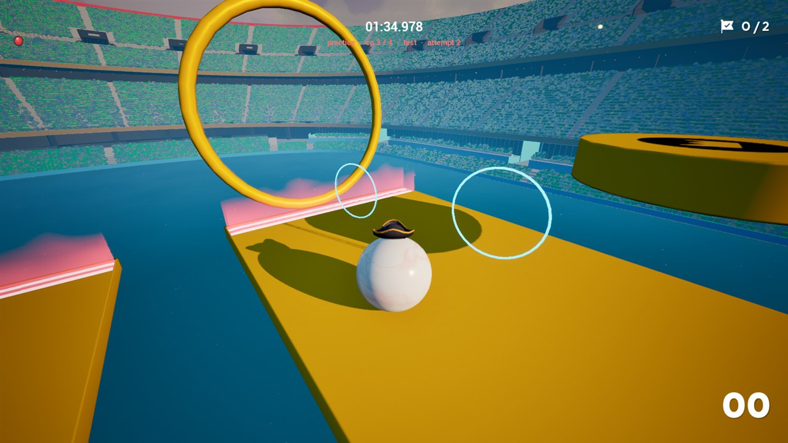
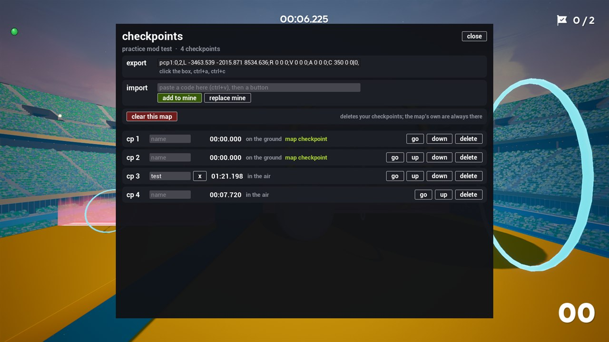

# Practice Checkpoints

Save the ball anywhere on a track, with its speed, and go back to it to practise a section. For
[Ballest of Them All](https://store.steampowered.com/app/3339810/), through the
[Ballest plugin manager](https://github.com/AnythingGoes-ballest/ballest-plugin-manager) (0.12.0 or later).

## Practice can't post a time

Going to a checkpoint turns the run into a **practice run**:
- The game's timer stops, and the plugin's own run timer shows in its place.
- The game's checkpoints and the finish stop counting, though the goal rings stay solid.
- The leaderboard and ghosts are hidden.

A ball at the top left shows what kind of run it is: **green** means the run counts, **red** means practice.

Restarting on checkpoint 0 (the start), or with the full restart key, gives a clean run that counts. In a clean run the
plugin stays out of the way: the checkpoint counter is hidden, and the map's checkpoints work as the game makes them.

## Keys

| Key | Does |
|---|---|
| F5 | Save a checkpoint where the ball is |
| F7 / F8 | Previous / next checkpoint (goes there) |
| F9 | Delete the current checkpoint |
| F10 | Delete all your own checkpoints on this map (the map's checkpoints stay) |
| R (the game's restart) | Restart on the current checkpoint, keeping its speed |
| Backspace | Full restart: back to the start, for a run that counts |
| Shift | Hold with F7, F8 or R to land standing still, without the speed |
| F4 | The checkpoints window |

Every key can be changed in the plugin's settings (plugin manager > installed > Practice Checkpoints). Controller buttons
work too (PadA, PadLB, ...).

## What else it does

- **Map checkpoints:** the map's own checkpoints are added to your list by themselves. While practising, touching one
  makes it your current checkpoint.
- **Markers:** a glowing ring shows each of your checkpoints on the track (the first 20). The markers need one of the
  game's hats, or no hat, on your ball.
- **Checkpoints window (F4):** go to, reorder, name or delete checkpoints. Share a map's checkpoints with an export code,
  or import someone else's.
- **Saved per map:** your checkpoints are still there the next time you play the map. In the track editor, save the map
  first.
- **Attempts:** each checkpoint counts how many times you've gone to it this session.

## Settings

Besides the keys: follow map checkpoints, turn the camera when going to a checkpoint, show markers, show the run timer,
show the run indicator, timer size, and a debug log.
